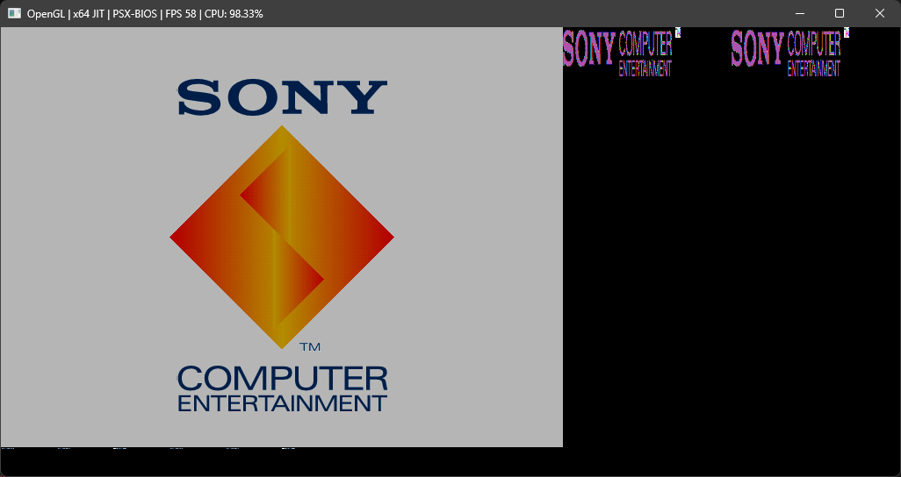
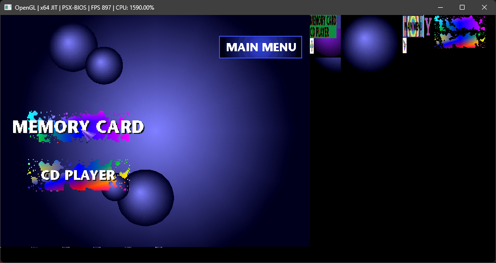
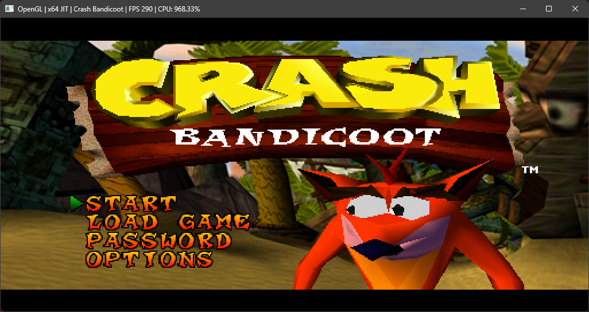
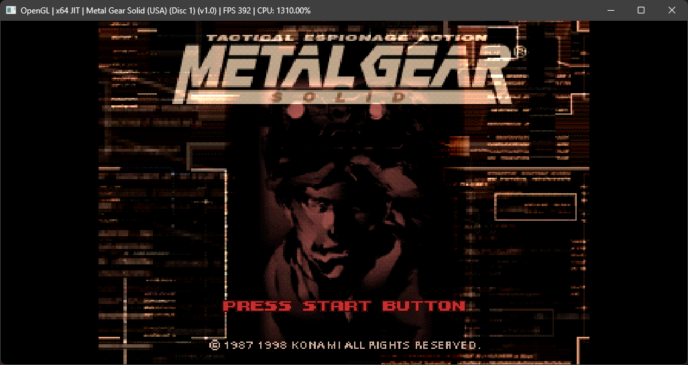

# PSXSharp

PSX# is a WIP PlayStation 1 emulator written in C#.
This project is a personal project for the purpose of learning more about emulation development and computer architecture.

# Showcase
<table>
  <tr>
    <td align="center">
       
      PSX-BIOS
    </td>
    <td align="center">
       
      PSX-BIOS
    </td>
  </tr>

   <tr>
    <td align="center">
       
      Crash Bandicoot
    </td>
    <td align="center">
       
      Metal Gear Solid
    </td>
  </tr>  
</table>

## What Has Been Implemented

- CPU (MIPS R3000)
  - Interpreter
  - MSIL Recompiler (Experimental)
  - x64 Recompiler (Experimental)
  - COP0 
  - GTE
- GPU
  - OpenGL Renderer
  - All drawing commands
  - All texture and shading modes
  - Dithering
  - 24 bit display mode 
  - All transfer commands
- SPU
  - SPU-ADPCM
  - SPU Reverb
- CDROM
  - Most commands
  - XA-ADPCM and CDDA support
  - Audio disks support
- MDEC
  - All modes (4/8/15/24) BPP
- Controller and Memory Cards
- Timers
- DMA

## What Are The Next Goals 
- Optimize CPU recompilers
- Implement CPU I-Cache
- Implement accurate instruction timing
- Fix GPU semi-transparency bugs
- Implement SPU noise generator 
- Implement the remaining CDROM Commands
- Implement CDROM Seek time
- Implement MDEC timing
- Implement DMA timing
- Implement a nice UI
- General code refactoring

The list goes on...

